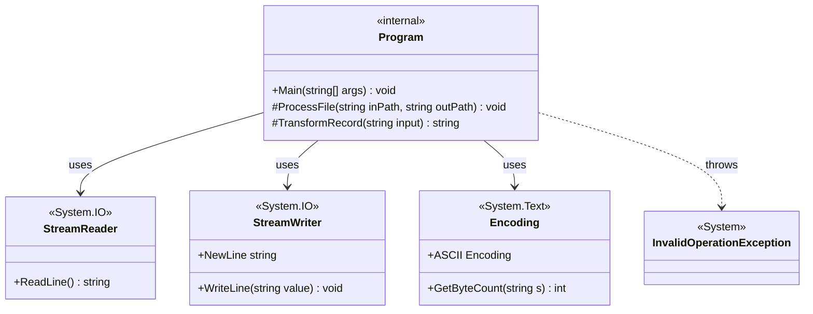
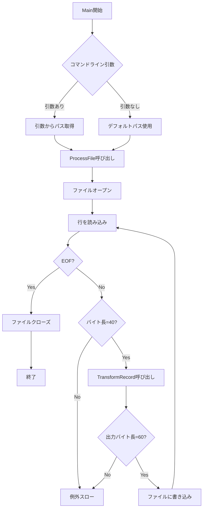

# CobolMvpRuntime クラス図

## 概要

`src/CobolMvpRuntime/Program.cs` のクラス構造を表すクラス図です。

## クラス図



## クラス詳細

### Program (internal)

COBOLのMVP01サンプルをC#で実装したクラス。固定長40バイトのレコードを読み込み、60バイトのレコードに変換して出力する。

#### メソッド

| メソッド | アクセス修飾子 | 戻り値 | 説明 |
|---------|---------------|--------|------|
| `Main` | `public static` | `void` | エントリーポイント。コマンドライン引数から入力ファイルと出力ファイルのパスを取得し、`ProcessFile`を呼び出す。 |
| `ProcessFile` | `internal static` | `void` | ファイルを読み込み、各行を処理して出力ファイルに書き込む。入力レコードのバイト長が40でない場合、または出力レコードのバイト長が60でない場合は例外をスローする。 |
| `TransformRecord` | `internal static` | `string` | 40バイトの入力レコードを60バイトの出力レコードに変換する。CUST-ID、NAME、QTY、UNIT-PRICEを抽出し、TOTAL（Qty*UnitPrice）とBIG-FLAG（Qty>=100なら'Y'、それ以外'N'）を計算して返す。 |

#### 依存関係

- `System.IO.StreamReader`: ファイル読み込みに使用
- `System.IO.StreamWriter`: ファイル書き込みに使用
- `System.Text.Encoding`: ASCIIエンコーディングとバイト長計算に使用
- `System.InvalidOperationException`: レコード長が不正な場合にスロー

## レコード構造

### 入力レコード（40バイト）

```
+--------+----------------------+-----+--------+-------+
| CUST-ID| NAME                 | QTY |UNIT-PRC|FILLER |
|  5     |  20                  |  3  |   5    |   7   |
+--------+----------------------+-----+--------+-------+
```

### 出力レコード（60バイト）

```
+--------+----------------------+-----+--------+-------+----+--------+
| CUST-ID| NAME                 | QTY |UNIT-PRC| TOTAL |FLAG|FILLER  |
|  5     |  20                  |  3  |   5    |   7   | 1  |  19    |
+--------+----------------------+-----+--------+-------+----+--------+
```

## 処理フロー



## 関連ファイル

- ソースコード: `src/CobolMvpRuntime/Program.cs`
- テストコード: `tests/CobolMvpRuntimeTests.cs`
- COBOL元プログラム: `docs/samples/mvp01/cobol/MVP01.cbl`
- 実装ログ: `docs/prompts/exec/2026-02-08_01_Implement_CobolMvpRuntime.md`
