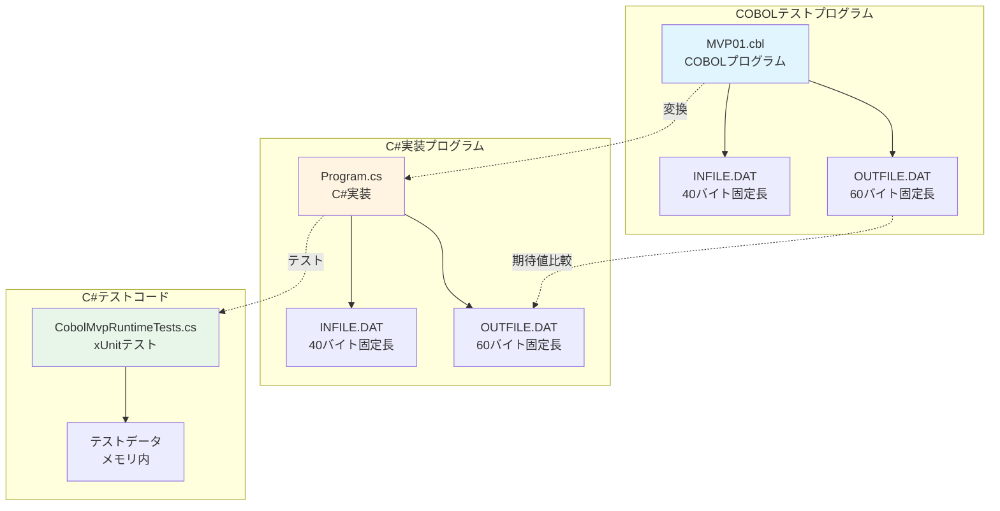
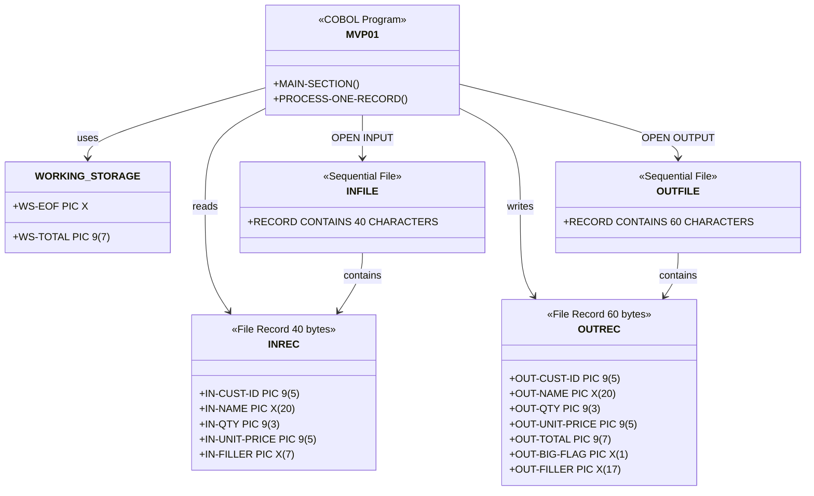
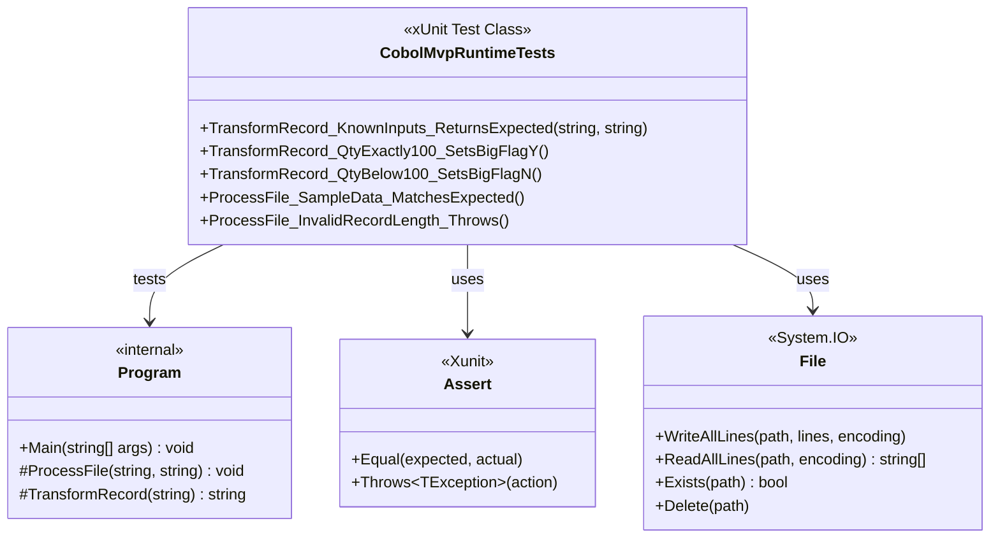
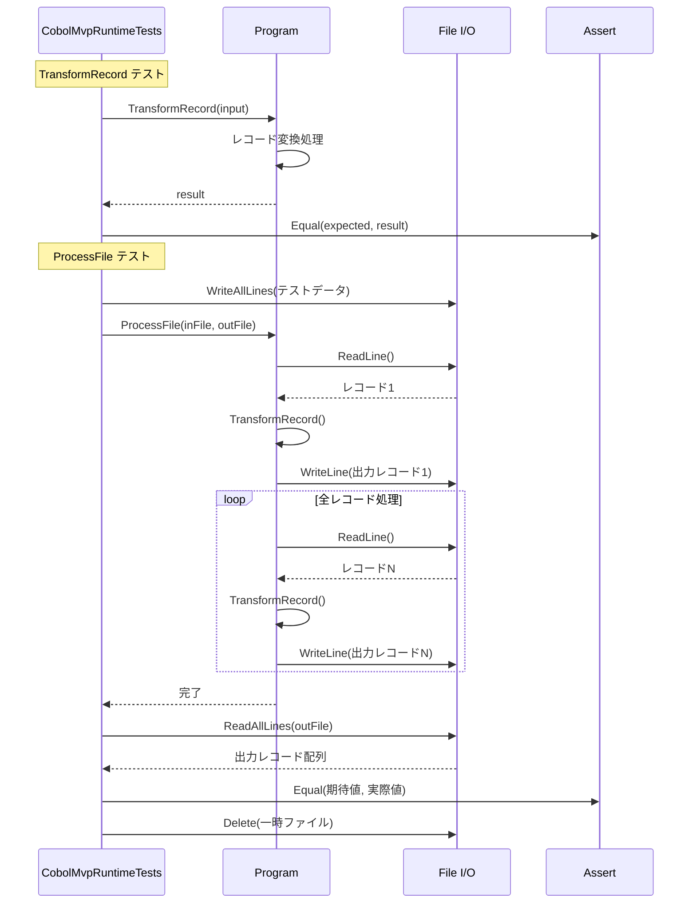
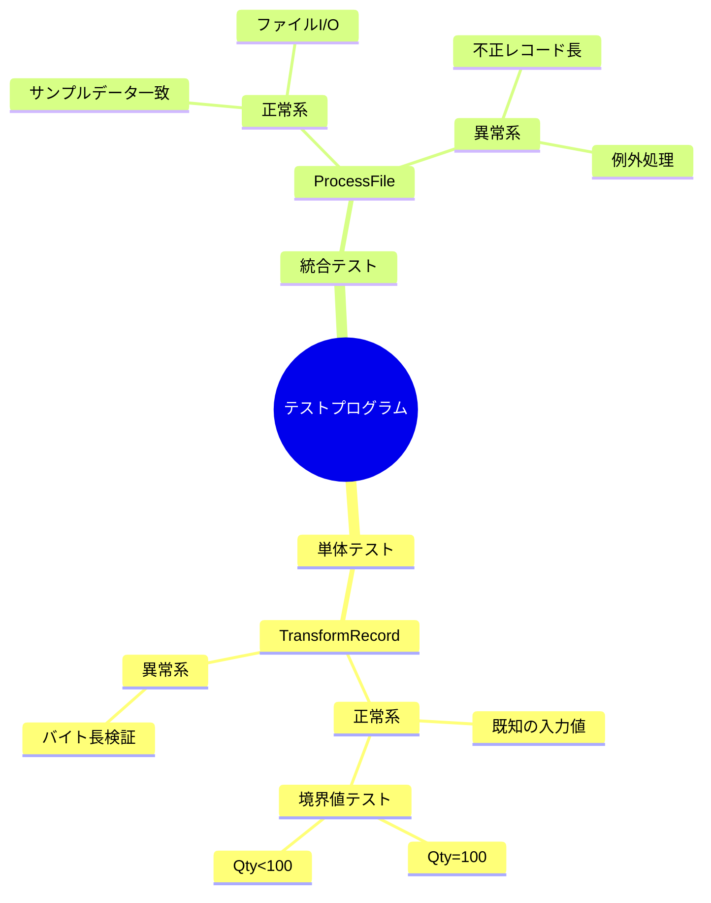
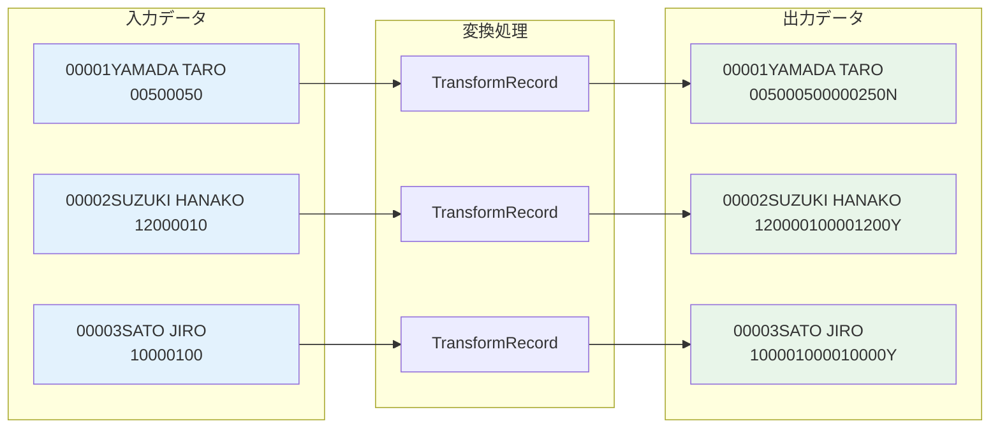
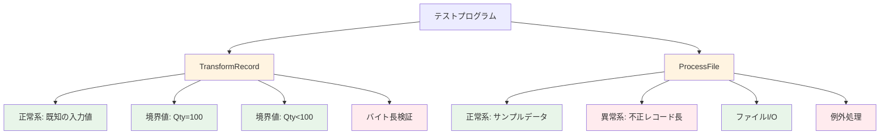
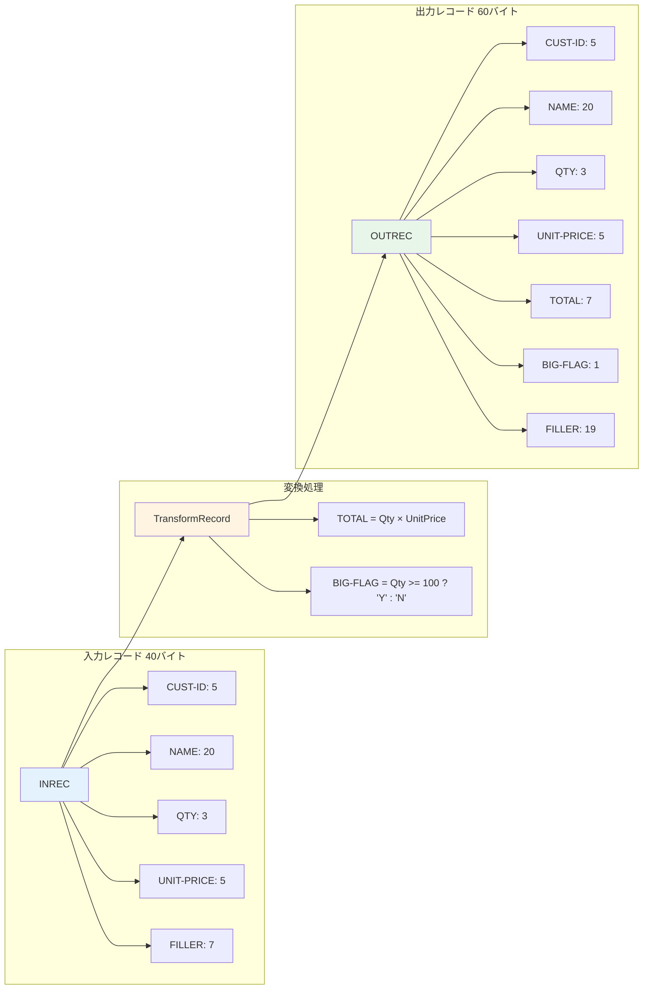

# テストプログラム構造ダイアグラム

## 概要

MVP01テストプログラムの構造を説明するダイアグラムです。COBOLテストプログラム、C#実装プログラム、C#テストコードの関係性と構造を示します。

## テストプログラム全体構造

## COBOLテストプログラム構造

## C#テストコード構造

## テスト実行フロー

## テストケース分類

## データフロー

## テストカバレッジ

## レコード構造比較

## 関連ファイル

- COBOLテストプログラム: `docs/samples/mvp01/cobol/MVP01.cbl`
- C#実装プログラム: `src/CobolMvpRuntime/Program.cs`
- C#テストコード: `tests/CobolMvpRuntimeTests.cs`
- テストデータ: `samples/mvp01/INFILE.DAT`, `samples/mvp01/OUTFILE_expected.DAT`
- クラス図: `docs/diagrams/CobolMvpRuntime_ClassDiagram.md`
