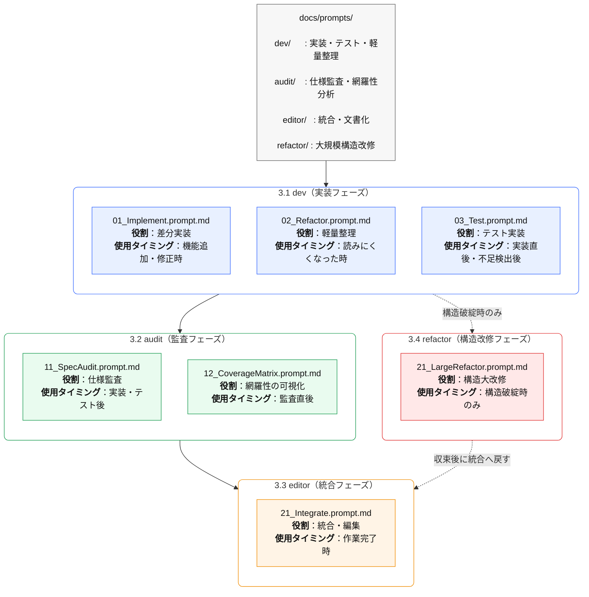
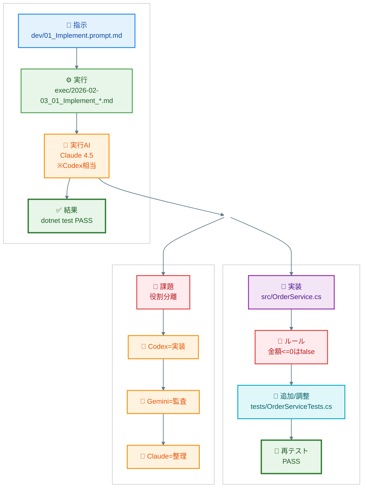
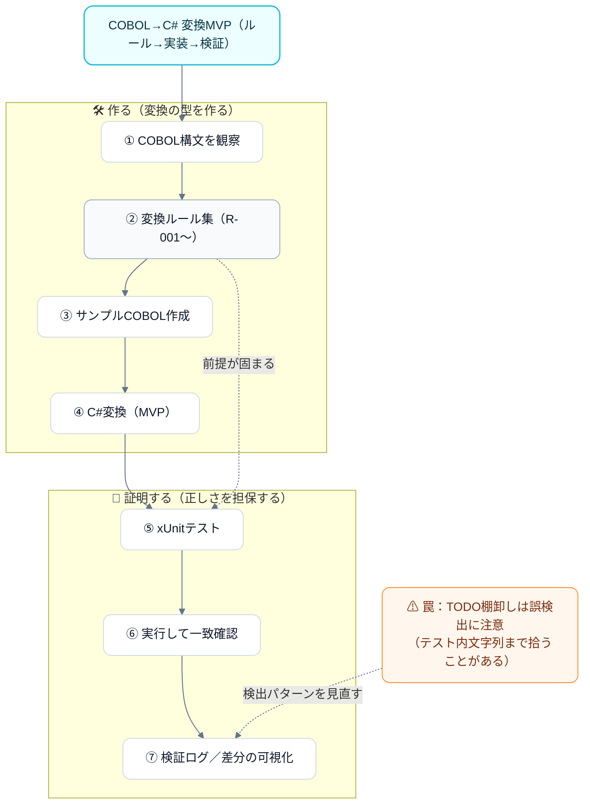

```mermaid
flowchart TB
  subgraph L[チャット運用]
    L1[AI① ChatGPT\n統合・編集] --> L2[途中成果物\nmd / Missing / diff画像]
    L2 --> L3[チャットへアップロード]
    L3 --> L4[AI② Gemini\n監査・Missing生成]
    L4 --> L5[結果をダウンロード/コピペ]
    L5 --> L6[AI③ Claude/Codex\n改修・実装]
    L6 --> L7[更新版を再アップロード]
    L7   --> L1
  end

  subgraph R[IDE運用（repo内で完結）]
    R0[(Git repo)] --> R1[docs/ が唯一の正\nspec / prompts / decisions]
    R1 --> R2[AI役割分担で作業\n（拡張/Agent）]
    R2 --> R3[差分（patch）適用]
    R3 --> R4[ローカル実行\nbuild/test]
    R4 --> R5[git diff / commit / tag]
    R5 --> R1
  end

  L2 -.課題: 運搬コスト.- R1
  ``` 

```mermaid
flowchart TB
  T[AI役割分担（モデル名ではなく“役割”で固定）]

  T --> A[🧭 ChatGPT\n統合・仕様/ルールの最終決定\n成果物（docs/）の編集長]
  T --> B[🔎 Gemini\n監査・抜け漏れ検出\nCoverage / Missing / 優先度付け]
  T --> C[🛡️ Claude\n探索・大改修\n複数ファイル横断リファクタ]
  T --> D[⚙️ Codex系\n実装・テスト生成\n差分（patch）で出力]

  A --> E[(Single Source of Truth)\nrepo/docs/]
  B --> E
  C --> E
  D --> E
```
```mermaid
flowchart TB
  %% =========================
  %% AI分業ポスター
  %% =========================

  subgraph RULE[AI運用ルール（固定）]
    R1[1タスク=1AI=1役割]
    R2[設計・仕様の決定権：人間＋ChatGPT]
    R3[正はGit：会話ログは正本にしない]
  end

  subgraph AI[使用AIと役割]
    A[ChatGPT\n編集長/司令塔]
    B[Codex\n実装担当]
    C[Gemini\n監査担当]
    D[Claude\n探索・改修担当]
  end

  subgraph FILE[ファイル別AI割当]
    F1[docs/spec/*.md\n→ ChatGPT]
    F2[docs/decisions/*.md\n→ ChatGPT]
    F3[src/**\n→ Codex]
    F4[tests/**\n→ Codex → Gemini]
    F5[複数ファイル横断\n→ Claude]
  end

  RULE --> AI --> FILE
  FILE --> W["標準フロー：ChatGPTで確定 → Codex実装 → ローカル検証<br/>Gemini監査 → Claude整理 → ChatGPTで更新"]
  ```

  
  
  
  
  
  
```mermaid
%%{init: {"flowchart": {"rankSpacing": 20, "nodeSpacing": 18}} }%%
flowchart TB
  %% =========================
  %% AI分業ポスター（X貼り付け前提：文言短め・折返し抑制）
  %% =========================

  subgraph RULE["AI運用ルール（固定）"]
   direction TB
    R1["1タスク=1AI=1役割<br/>同一チャットで混在しない"]
    R2["決定権：人間＋ChatGPT<br/>設計・仕様はAIに委ねない"]
    R3["正本はGit管理<br/>会話ログは参考扱い"]
  end

  subgraph AI["使用AIと役割"]
   direction TB
    A["ChatGPT<br/>編集長 / 司令塔"]
    B["Codex<br/>実 装担当"]
    C["Gemini<br/>監査担当"]
    D["Claude<br/>探索・改修担当"]
  end

  subgraph FILE["ファイル別AI割当"]
    F1["docs/spec/*.md<br/>ChatGPT：仕様の正本"]
    F2["docs/decisions/*.md<br/>ChatGPT：ADR（判断記録）"]
    F3["src/**<br/>Codex：差分で実装"]
    F4["tests/**<br/>Codex→Gemini：実装後に監査"]
    F5["複数ファイル横断<br/>Claude：構造整理のみ"]
  end

  subgraph FLOW["標準フロー"]
    W["標準フロー：<br/>ChatGPTで確定 → Codex実装 → ローカル検証<br/>Gemini監査 → Claude整理 → ChatGPTで更新"]
  end

  RULE --> AI --> FILE --> FLOW


```
## 2026/01/29 

  
```mermaid
flowchart LR
  %% ===== ポスター：たるい原因の正体（横長・左→右） =====
  %% 超安全版：C2の各項目を「1項目＝2行」に分割してはみ出し防止

  subgraph L["🟦 現状（VSCode＋複数AI分業）"]
    direction TB
    L1["🟦 VSCode運用<br/>ChatGPT＋Gemini＋Claude"]
    L2["🟦 目的：COBOL→C#移行<br/>業務分析→仕様化<br/>ルール化→検証→ツール化"]
    L3["🟨 ハンドオフが多い<br/>コピペ範囲が増える<br/>正本更新が重い"]
    L1 --> L2 --> L3
  end

  subgraph C["🟥 重さの原因（正体）"]
    direction TB
    C1["🟥 AI人数ではない"]
    C2["🟥 手続き摩擦（運用の摩擦）<br/>・正本（docs/ADR/spec）<br/>　更新コストが高い<br/>・差分が収束しない<br/>　→レビューが肥大化<br/>・責任分界が曖昧<br/>　→判断が揺れがち"]
    C3["🟪 結果：<br/>『たるい』と感じる"]
    C1 --> C2 --> C3
  end

  subgraph R["🟩 処方箋（速さを取り込む）"]
    direction TB
    R1["🟦 司令塔で固定<br/>受入基準／正本<br/>変更範囲を明示"]
    R2["🟩 実装は差分生成に限定<br/>変更ファイルを明示"]
    R3["🟨 Geminiで監査固定<br/>Coverage／Missing<br/>仕様逸脱／テスト不足"]
    R4["🟪 ループ：<br/>Plan→Diff→Test→Audit→Update"]
    R1 --> R2 --> R3 --> R4
  end

  L --> C --> R

  %% 強調（見た目）
  classDef blue fill:#e8f2ff,stroke:#1f6feb,stroke-width:2px,color:#0b2e6b;
  classDef red fill:#ffe8e8,stro:q
  ke:#cf222e,stroke-width:2px,color:#6b0b0b;
  classDef green fill:#eaffea,stroke:#2da44e,stroke-width:2px,color:#0b6b2e;
  classDef yellow fill:#fff8dc,stroke:#bf8700,stroke-width:1.5px,color:#5a4300;
  classDef purple fill:#f2e8ff,stroke:#8250df,stroke-width:1.5px,color:#3b1d7a;

  class L1,L2 blue;
  class L3 yellow;

  class C1,C2 red;
  class C3 purple;

  class R1 blue;
  class R2 green;
  class R3 yellow;
  class R4 purple;

```
## 2026/02/03


## 2026/02/04


# 2026/02/14

